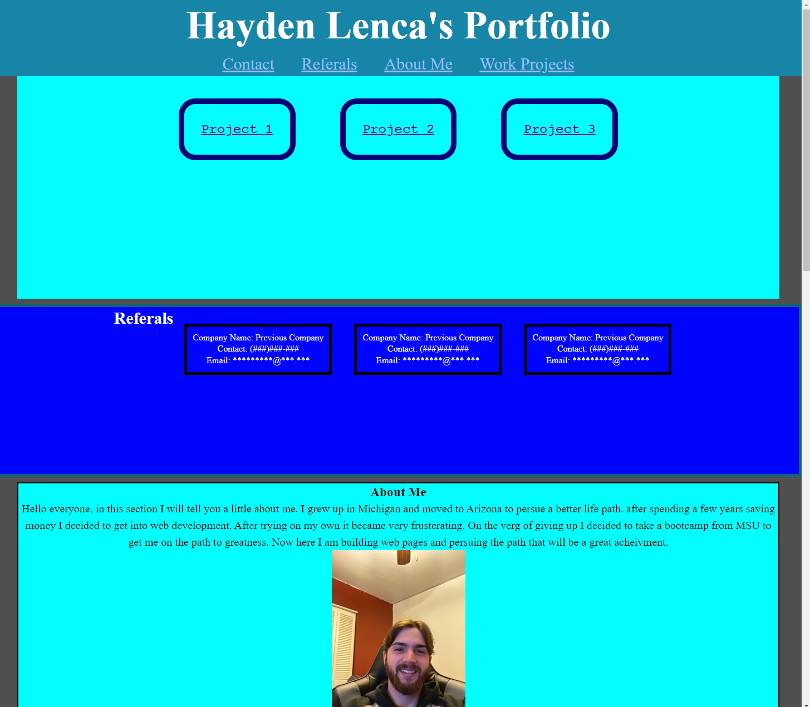
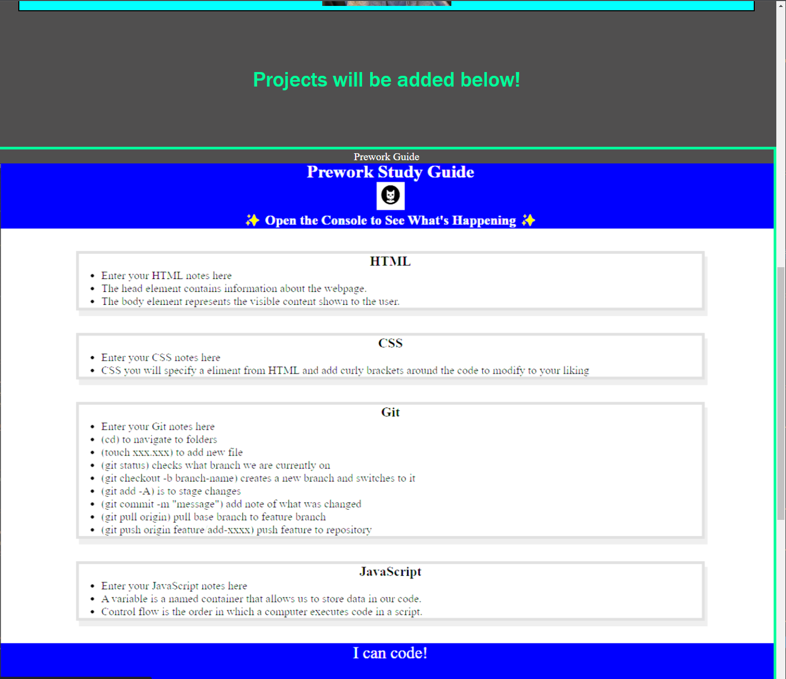
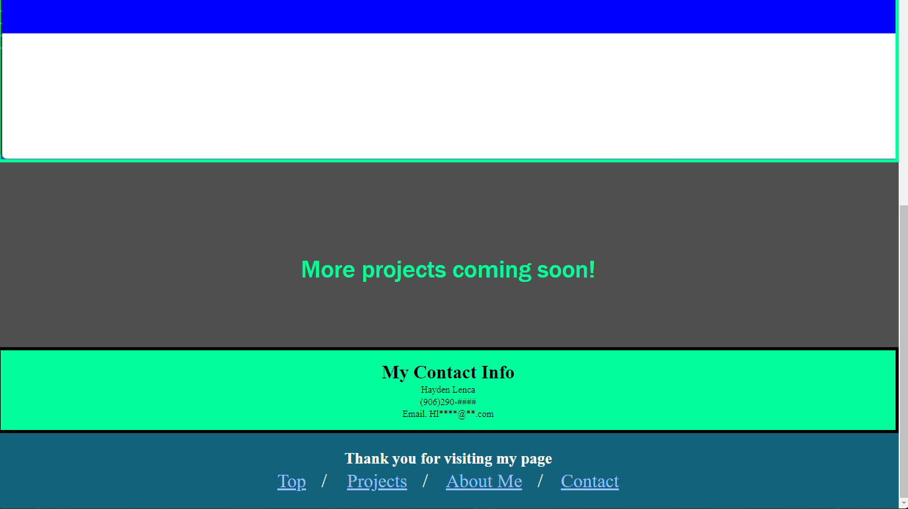

# <My Portfolio>

## Description

Starting this jurney has been a lot to tak in and learn. Seeing how you can get a page together it is a great accomplishment.
With this project I have a portfolio page with an about me section, my first project and contact. Over time it will be updated to look cleaner and add more of my projects.

## Installation

N/A

## Usage

I am setting this page up to be veiwed by potetioal employers to view my work.

## Credits

N/A

## Links

[Git Hub](https://github.com/HaydenLenca/Hayden-Lenca-Portfolio)

[Deployed Site](https://haydenlenca.github.io/Hayden-Lenca-Portfolio/)

## License

Please refer to the LICENSE in the repo.

